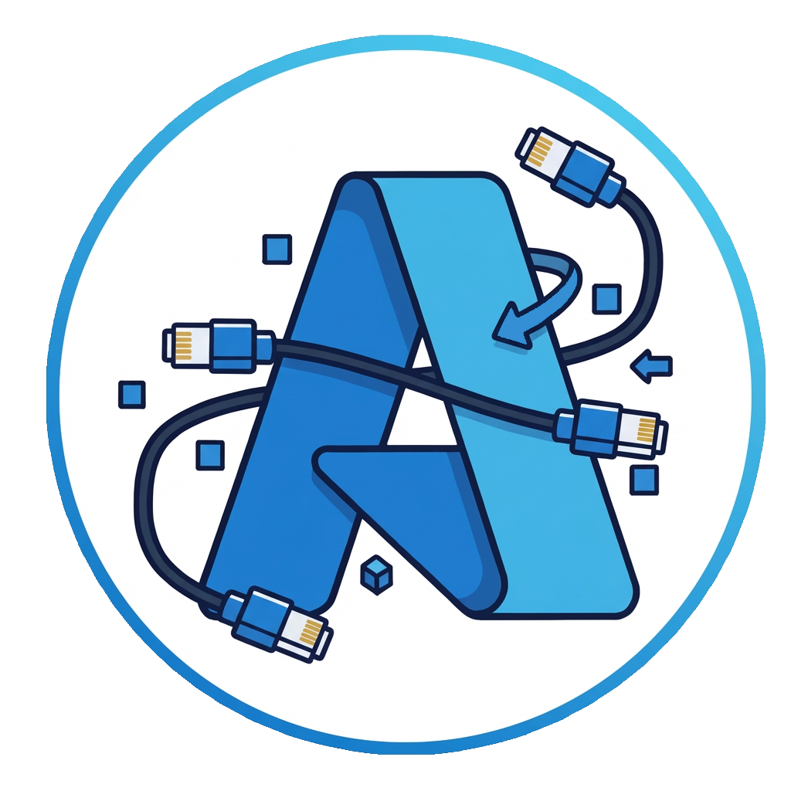

# aznet

<p align="center"></p>

Go `net.Conn` and `net.Listener` interfaces over pluggable transports, with built-in drivers for Azure Storage services.

aznet has a driver-agnostic core that handles ordered, encrypted byte streams. Drivers provide the underlying transport; the built-in drivers use storage requests and polling. Applications use familiar Go I/O, but must account for storage latency, credential lifetime, finite buffers and cleanup ownership. Noise NN encrypts application frames without authenticating peer identity.

## Start here

Follow [Getting started](docs/src/content/docs/getting-started.md) to run a complete local round trip with Azurite and the `examples/quickstart` program. It prints `hello aznet`, verifies delivery and cleans up its demo resources.

To add the library to an existing Go project:

```bash
go get github.com/atsika/aznet
```

Use Go with automatic toolchain selection enabled. To try the built-in storage drivers, use an Azure Storage account or a local Azurite instance.

- [Getting started](docs/src/content/docs/getting-started.md)
- [API, delivery and cleanup contracts](docs/src/content/docs/reference/api.md)
- [Custom driver contracts and migration](docs/src/content/docs/guides/developing-drivers.md)
- [Validation evidence and rollout requirements](docs/src/content/docs/guides/validation.md)
- [Security and authorization](docs/src/content/docs/core-concepts/security.md)
- [Measured performance](docs/src/content/docs/drivers/performance.md)

Full Close may delete unread session data. For delivery-sensitive responses, use CloseWrite and application-level completion before Close. Listener Close retains shared bootstrap resources; their administrator removes them explicitly after all namespace users stop. Neither credential renewal nor crash-proof remote cleanup is automatic.

## Development

```bash
go test -race -count=1 ./...
go vet ./...
```

External-service tests require explicit opt-in; see the validation guide. The Starlight documentation uses **Bun 1.4.2** and the committed `docs/bun.lock`. To install the locked dependencies and build:

```bash
cd docs
bun install --frozen-lockfile
bun run build
# For local editing:
bun run dev
```

The Driver/Transport registration mechanism remains the extension point. See the driver guide before changing ordering, retries or resource ownership.

## License

[MIT](LICENSE).

## Credits

Built with the [Noise Protocol](https://noiseprotocol.org/) and [Azure SDK for Go](https://github.com/Azure/azure-sdk-for-go).

---

Made with ❤️ by [@_atsika](https://x.com/_atsika)
