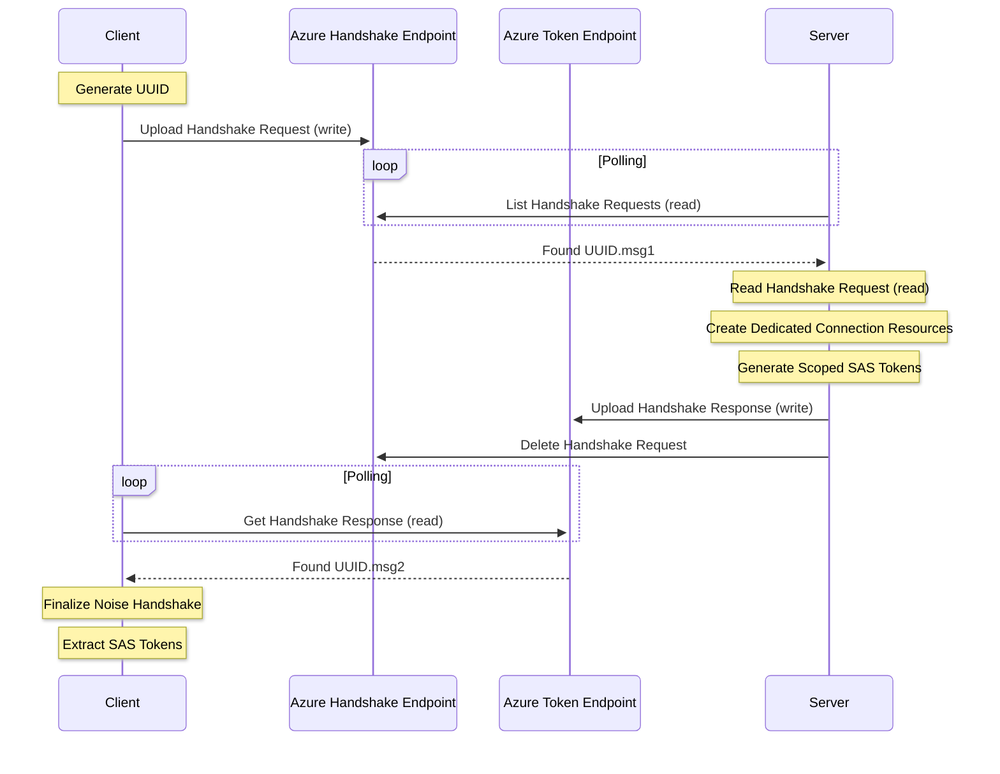

`aznet` is designed to be a transparent bridge between standard Go networking and Azure Storage services.
This page explains the philosophy behind the project and how it manages data flow.

## Philosophy

The core idea of `aznet` is **"Network Anywhere"**. Traditional networking (TCP/UDP) is often restricted by:

- Complex firewall rules.
- Network Address Translation (NAT).
- Lack of stable IP addresses in serverless environments.

By using Azure Storage as a transport layer, `aznet` bypasses these issues.
If you can reach `*.core.windows.net` via HTTPS, you can establish a bi-directional networking connection.

### Design Principles
1. **Interface Compatibility**: Strictly adhere to `net.Conn` and `net.Listener`.
2. **Ephemeral Resources**: Azure resources (containers, queues, tables) should exist only as long as the connection.
3. **Security First**: No plaintext data should ever touch Azure.
4. **Driver Agnostic**: The application shouldn't care which Azure service is used under the hood.

## Framing & Message Types

All data sent through `aznet` is encapsulated in a binary framing system.
This ensures that control messages (like heartbeats and connection termination) can be multiplexed with application data.

### Frame Format
Each frame consists of a header and a payload:
- **Length** (4 bytes): Big-endian unsigned integer representing the payload size.
- **Type** (1 byte): The category of the message.
- **Payload** (N bytes): The actual message content.

The maximum size of a single frame (MTU) is derived from the driver's `MaxRawSize()` minus the
encryption overhead (20 bytes) and the aznet frame header (5 bytes).

### Message Types
`aznet` defines four distinct message types:

| Type       | Code   | Description                                              |
| :--------- | :----- | :------------------------------------------------------- |
| **Data**   | `0x00` | Standard application payload.                            |
| **Ping**   | `0x01` | Keep-alive heartbeat to prevent idle timeouts.           |
| **Fin**    | `0x02` | Graceful connection termination (half-close).            |
| **Rotate** | `0x03` | Notifies the peer that a resource rotation is occurring. |

## Connection Lifecycle

Establishing an `aznet` connection involves several steps to ensure security and isolation.

### Handshake Sequence
The following diagram illustrates the initial connection establishment between a client and a server.

### 1. Handshake Phase
The client initiates a handshake using the Noise Protocol.
1. **Client** generates a unique connection ID (UUID) and sends an initial handshake message to the server's `handshake` endpoint.
2. **Server** periodically polls the `handshake` endpoint.
   When it finds a new request, it extracts the connection UUID and creates **dedicated Azure resources** for this connection.
3. **Server** generates scoped **SAS (Shared Access Signature) tokens** for these resources.
4. **Server** sends a response containing the SAS tokens (encrypted within the Noise handshake) to the `token` endpoint using the client's UUID as the identifier.
5. **Client** polls the `token` endpoint for the server's response, decrypts the tokens, and finalizes the connection.

### 2. Data Transfer Phase
Once the handshake is complete, both parties have:
1. A shared symmetric encryption key.
2. Direct access to the dedicated Azure Storage resources.

Data is split into chunks, encrypted locally, and uploaded to Azure.
The other party **polls** Azure for new chunks, downloads them, decrypts them, and presents them to the application.

### 3. Closure Phase
- When a party calls `Close()`, a `MsgTypeFin` message is sent.
- The connection supports half-close via `CloseWrite()`.
- The **Janitor** (a background process on the server) identifies closed or timed-out connections and
  deletes the associated Azure Storage resources.

## Internal Components

### Drivers

Drivers implement the low-level logic for interacting with specific Azure services.
They handle resource creation, chunk management, and polling logic.

### Adaptive Poller

To balance latency and cost, `aznet` uses an adaptive polling strategy.
It increases polling frequency when data is actively flowing and slows down during idle periods.

### Janitor

The Janitor is responsible for garbage collection of Azure resources.
It monitors `peerLastSeen` timestamps and connection states to ensure that ephemeral resources are cleaned up promptly.
