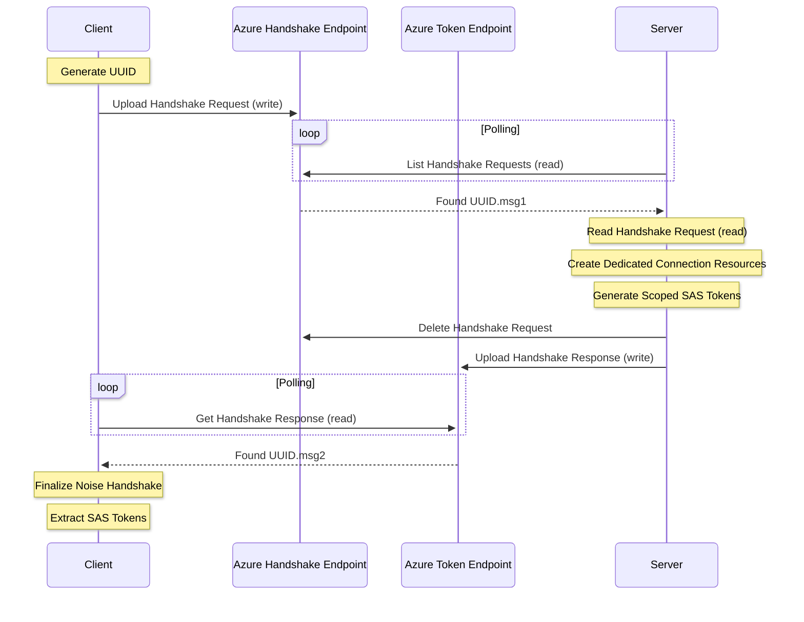

`aznet` is designed to be a transparent bridge between standard Go networking and Azure Storage services.
This page explains the philosophy behind the project and how it manages data flow.

## Philosophy

The core idea of `aznet` is **"Network Anywhere"**. Traditional networking (TCP/UDP) is often restricted by:

- Complex firewall rules.
- Network Address Translation (NAT).
- Lack of stable IP addresses in serverless environments.

Azure Storage provides a rendezvous and data path when both endpoints have authorized network access and valid credentials. Storage firewall rules, credential permissions, expiry and service availability still apply.

### Design Principles
1. **Interface Compatibility**: Expose `net.Conn` and `net.Listener`, with storage latency and explicit delivery/cleanup semantics.
2. **Resource Ownership**: The listener owns accepted-session cleanup; shared bootstrap resources outlive it.
3. **Encryption**: Encrypt application frames; anonymous Noise NN does not authenticate peers or hide all metadata.
4. **Driver Agnostic**: The application shouldn't care which Azure service is used under the hood.

## Framing & Message Types

All data sent through `aznet` is encapsulated in a binary framing system.
This ensures that control messages (like heartbeats and connection termination) can be multiplexed with application data.

### Frame Format
Each frame consists of a header and a payload:
- **Length** (4 bytes): Big-endian unsigned integer representing the payload size.
- **Type** (1 byte): The category of the message.
- **Payload** (N bytes): The actual message content.

The maximum size of a single frame (MTU) is derived from the driver's `MaxRawSize()` minus the
encryption overhead (20 bytes) and the aznet frame header (5 bytes), further constrained by configured write/retry allowances.

### Message Types
`aznet` defines four distinct message types:

| Type       | Code   | Description                                              |
| :--------- | :----- | :------------------------------------------------------- |
| **Data**   | `0x00` | Standard application payload.                            |
| **Ping**   | `0x01` | Keep-alive heartbeat to prevent idle timeouts.           |
| **Fin**    | `0x02` | Graceful connection termination (half-close).            |
| **Rotate** | `0x03` | Notifies the peer that a resource rotation is occurring. |

## Connection Lifecycle

Establishing an `aznet` connection involves several steps to ensure security and isolation.

### Handshake Sequence
The following diagram illustrates the initial connection establishment between a client and a server.

```mermaid
---
config:
  look: neo
---
sequenceDiagram
    participant Client
    participant HandshakeStorage as Azure Handshake Endpoint
    participant TokenStorage as Azure Token Endpoint
    participant Server

    Note over Client: Generate UUID
    Client->>HandshakeStorage: Upload Handshake Request (write)
    
    loop Polling
        Server->>HandshakeStorage: List Handshake Requests (read)
    end
    
    HandshakeStorage-->>Server: Found UUID.msg1
    Note over Server: Read Handshake Request (read)
    Note over Server: Create Dedicated Connection Resources
    Note over Server: Generate Scoped SAS Tokens
    
    Server->>HandshakeStorage: Delete Handshake Request
    Server->>TokenStorage: Upload Handshake Response (write)
    
    loop Polling
        Client->>TokenStorage: Get Handshake Response (read)
    end
    
    TokenStorage-->>Client: Found UUID.msg2
    Note over Client: Finalize Noise Handshake
    Note over Client: Extract SAS Tokens
```

### 1. Handshake Phase
The client initiates a handshake using the Noise Protocol.
1. **Client** generates a unique connection ID (UUID) and sends an initial handshake message to the server's `handshake` endpoint.
2. **Server** periodically polls the `handshake` endpoint.
   When it finds a new request, it extracts the connection UUID and creates **dedicated Azure resources** for this connection.
3. **Server** generates scoped **SAS (Shared Access Signature) tokens** for these resources.
4. **Server** sends a response containing the SAS tokens (encrypted within the Noise handshake) to the `token` endpoint using the client's UUID as the identifier.
5. **Client** polls the `token` endpoint for the server's response, decrypts the tokens, and finalizes the connection.

### 2. Data Transfer Phase
Once the handshake is complete, both parties have:
1. Separate directional cipher states derived by the anonymous handshake.
2. Direct access to the dedicated Azure Storage resources.

Data is split into chunks, encrypted locally, and uploaded to Azure.
The other party **polls** Azure for new chunks, downloads them, decrypts them, and presents them to the application.

### 3. Closure Phase
- `CloseWrite()` sends `MsgTypeFin` while preserving the reading side and session resources.
- `Close()` attempts buffered data and FIN within a bounded interval, then cancels I/O. On an accepted connection it also deletes session resources; applications requiring final-response delivery should half-close and wait for application-level completion before full Close.
- The **Janitor** closes idle sessions through the same cleanup owner. Listener Close reclaims sessions without depending on the janitor and reports cleanup failures.
- Shared bootstrap resources outlive listener Close. Their administrator explicitly calls `CleanupBootstrap(ctx)` after all namespace users have stopped.

## Internal Components

### Drivers

Drivers implement the low-level logic for interacting with specific Azure services.
They handle resource creation, chunk management, and polling logic.

### Adaptive Poller

To balance latency and cost, `aznet` uses an adaptive polling strategy.
It increases polling frequency when data is actively flowing and slows down during idle periods.

### Janitor

The Janitor is responsible for garbage collection of Azure resources.
It monitors `peerLastSeen` timestamps and connection states to close idle owned sessions. Crashes and backend failures still require external resource reconciliation.
