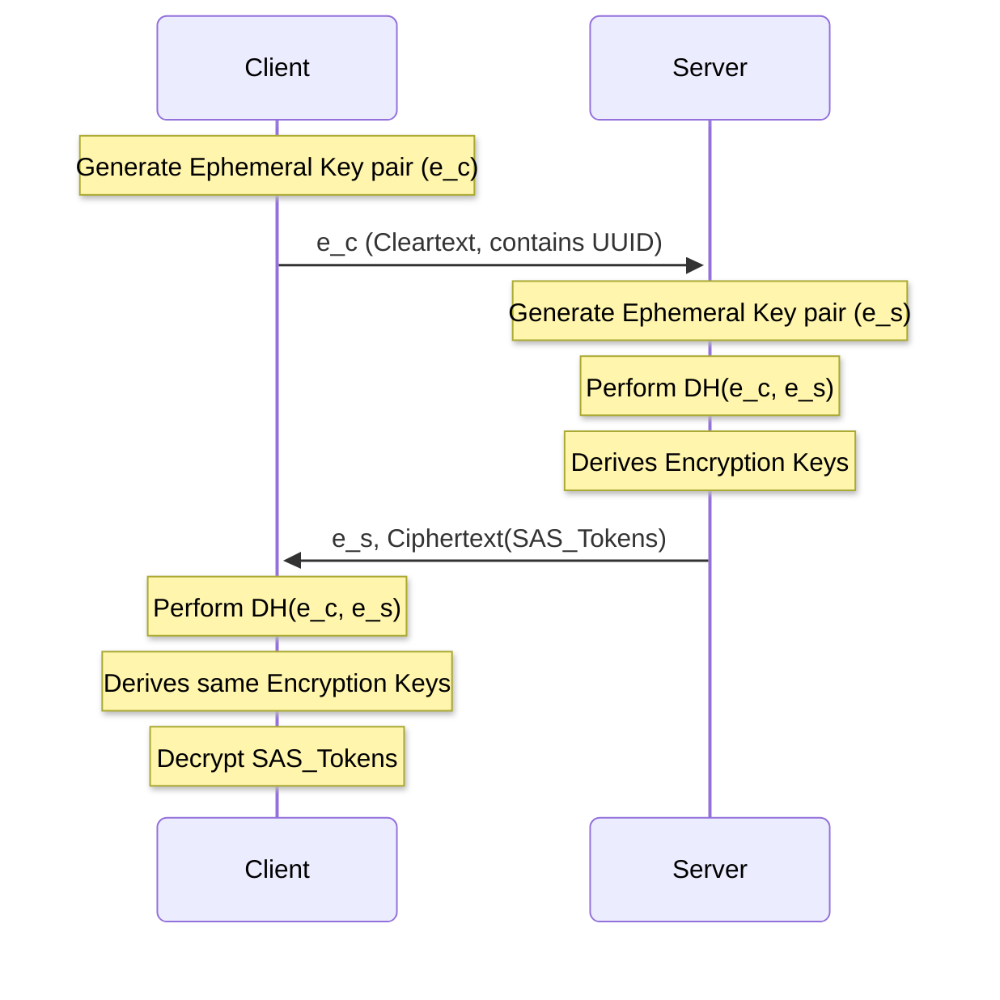
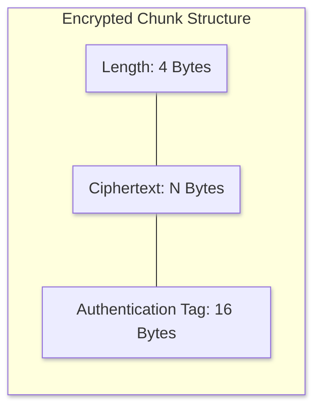

Security is a primary concern for `aznet`.
Since data travels through a third-party service (Azure Storage), it is critical that the data remains confidential
and authentic.

## End-to-End Encryption

`aznet` implements the **Noise Protocol Framework** to provide robust, authenticated, and encrypted communication.

### Noise Configuration

Specifically, `aznet` uses the `Noise_NN_25519_AESGCM_SHA256` pattern:

- **Pattern**: `NN` (Anonymous handshake). No static keys are required, and both parties remain anonymous during the handshake.
- **DH (Diffie-Hellman)**: Curve25519 for key exchange.
- **Cipher**: AES-256-GCM for Authenticated Encryption with Associated Data (AEAD).
- **Hash**: SHA-256 for cryptographic hashing.

### Handshake Flow (Noise NN)

The handshake process establishes the shared symmetric key without transmitting it.

### Encrypted Chunks

Data is encrypted into discrete chunks before being sent to the transport layer. Each encrypted chunk is prefixed with its own length:

- **Length** (4 bytes): Big-endian length of the following ciphertext.
- **Ciphertext**: The actual encrypted payload.
- **Authentication Tag**: (16 bytes) The AEAD authentication tag.

## Connection Isolation

Each connection is strictly isolated from others, even if they share the same Storage Account.

### Dedicated Resources

When a new connection is accepted, `aznet` generates a unique UUID to identify the session.

Each driver is responsible for creating isolated resources dedicated to that specific session. These resources (such as containers, blobs, queues, or tables) are named using the session UUID to ensure strict isolation between concurrent connections sharing the same Azure Storage account.

### SAS Tokens with Least Privilege

`aznet` does not share the main Storage Account Key with clients.
Instead, the server generates **Shared Access Signatures (SAS)** that:

- Are valid only for the specific resources of that connection.
- Have a short expiration time (configurable via `WithSASExpiry`).
- Grant only the necessary permissions.

## Threat Model & Mitigations

| Threat                   | Mitigation                                                                                                |
| :----------------------- | :-------------------------------------------------------------------------------------------------------- |
| **Azure Insider Access** | Data is end-to-end encrypted; Azure only sees encrypted blobs/messages.                                   |
| **Man-in-the-Middle**    | Noise Protocol (NN pattern) provides forward secrecy and data integrity through ephemeral DH key exchange. Note: NN is anonymous — it does not authenticate peers. |
| **Replay Attacks**       | AES-GCM provides sequence-based authentication; old or duplicate frames are rejected by the cipher state. |
| **Resource Exhaustion**  | The server's Janitor automatically cleans up leaked or old resources.                                     |

## Recommendations

1. **Rotate Account Keys**: Regularly rotate your main Azure Storage Account keys in the Azure Portal.
2. **Use HTTPS**: `aznet` communicates with Azure over HTTPS by default.
3. **Audit Logs**: Enable Azure Storage Analytics to monitor access patterns.
