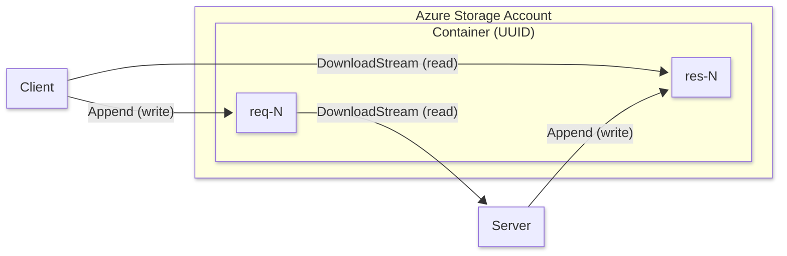
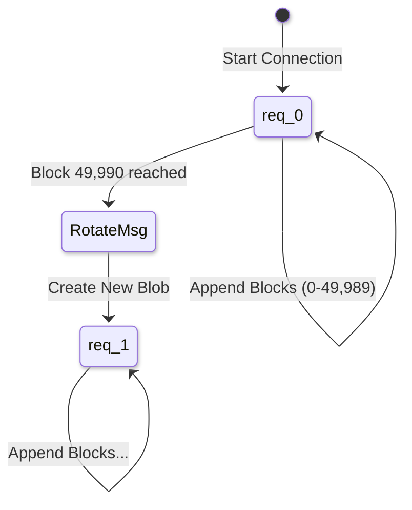

The `azblob` driver uses Azure Blob Storage as the underlying transport layer.
It is the most performant driver in `aznet`, designed for high-throughput data transfers.

## How it works

The `azblob` driver leverages **Append Blobs** to simulate a bi-directional network stream.

1. **Write Path**: Data is buffered into frames. When a flush is triggered, frames are encrypted and appended as a single block to the current "TX" Append Blob.
2. **Read Path**: The reader performs a range-based download starting from its current offset on the "RX" Append Blob. If no new data is available (416 Range Not Satisfiable or zero content length), it returns and the adaptive poller retries later.

## Resource Usage

For each connection, the driver creates:

- A unique **Container** named with the session UUID.
- Initial blobs: `req-0` and `res-0`.

## Technical Details

### Blob Rotation

Azure Append Blobs have a limit of **50,000 blocks** per blob.
To support long-running or high-volume connections, `aznet` implements automatic **Blob Rotation**.

- When a blob reaches **49,990 appends** (a safety threshold slightly below the Azure limit of 50,000), the driver:
  1. Sends a `MsgTypeRotate` control frame to the peer.
  2. Creates a new Append Blob with an incremented sequence number (e.g., `req-0` → `req-1`).
  3. Switches all future writes to the new blob.
- The peer, upon receiving the rotation notification, automatically switches its reader to the next sequence after exhausting the current blob.

## Performance

`azblob` is the throughput champion of `aznet`.

- **Storage Account**: For production workloads, use a **Premium Block Blob** account. This uses SSD storage, providing significantly lower latency and up to **3x higher throughput** compared to Standard (HDD) storage.
- **Chunk Size**: Defaults to **4 MB** (`MaxBlobBlockSize`). This is the maximum allowed size for a single append operation in Azure.
- **Throughput**: Up to **3.07 MB/s** sender / **2.65 MB/s** receiver (iperf3 benchmark through SOCKS proxy).
- **Transfer Pattern**: Smooth and consistent with zero retransmissions.

## Advantages

- **Speed**: Fastest driver available.
- **Large Chunks**: Efficiently handles streaming data.
- **Scalability**: Rotation ensures virtually unlimited data transfer.

## Limitations

- **Cost**: Higher per-operation costs than Queue storage for small writes.
- **Latency**: Polling-based reads introduce small delays.
