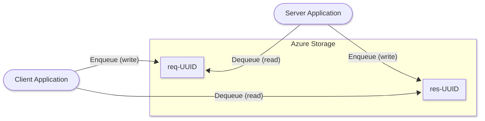

The `azqueue` driver uses Azure Queue Storage as the underlying transport layer.
It is optimized for cost-efficiency and is ideal for background tasks, log shipping, or low-priority data streams.

## How it works

The `azqueue` driver uses messages in a pair of queues to pass data between parties.

1. **Write Path**: Data is split into chunks, encrypted, and then **Base64 encoded** (required by Azure Queue Storage for binary data). Each encoded message is then enqueued.
2. **Read Path**: The reader polls the target queue for new messages using `DequeueMessages` (with a batch size of up to 32). Messages are downloaded, deleted from the queue, decoded from Base64, and then decrypted.

## Resource Usage

For each connection, the driver creates 2 dedicated **Queues**:

- `req-<UUID>`: Data sent from the client to the server.
- `res-<UUID>`: Data sent from the server to the client.

:::note[Storage Account Requirement]
You must use a **Standard** storage account (General Purpose v2). **Premium Block Blob** accounts do not support Queue Storage.
:::

## Technical Details

### Payload Limitations

Azure Queue Storage has a strict message size limit of **64 KB**.
Because `aznet` must Base64-encode the encrypted payload, the effective raw data limit per message is reduced.

- **Max Message Size**: 64 KB (Azure limit).
- **Max Raw Payload**: **48 KB** (derived from `MaxQueueTextMessageSize` minus Base64 overhead).
- **Overhead**: Base64 encoding adds approximately 33% to the data size.

### Cost Efficiency

`azqueue` is the most economical driver for high-frequency, small-payload communication.

- **Price**: ~€0.0004 per 10,000 operations.
- **Efficiency**: Operation for operation, it is up to **165x cheaper** than Blob Storage writes.

## Performance

- **Throughput**: Up to **1.11 MB/s** sender / **0.79 MB/s** receiver (iperf3 benchmark through SOCKS proxy).
- **Transfer Pattern**: Steady flow with occasional minor retransmissions.
- **Batching**: The driver automatically attempts to dequeue up to 32 messages in a single API call to improve performance during active transfers.

## Advantages

- **Lowest Cost**: Ideal for high-volume, cost-sensitive workloads.
- **Built-in Buffering**: Azure Queues act as a natural buffer; if the receiver is temporarily offline or slow, messages stay in the queue until the TTL expires.

## Limitations

- **Small Chunks**: 48 KB limit requires many more API calls for large data transfers.
- **Base64 Overhead**: Increased network traffic and processing cost due to encoding.
- **Speed**: Generally the slowest driver, not suitable for real-time interactivity.
