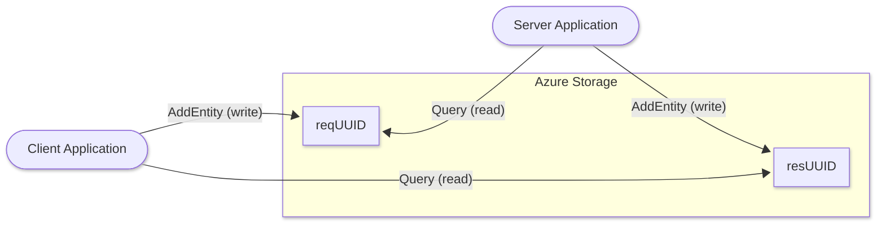

The `aztable` driver uses Azure Table Storage as the underlying transport layer.
While it provides a balanced architecture, it is generally the least performant and most expensive option in the `aznet` suite.

## How it works

The `aztable` driver stores data chunks as individual entities within a table.

```mermaid
---
config:
  look: neo
---
flowchart LR
    Client([Client Application])
    
    subgraph Azure [Azure Storage]
        direction TB
        req[reqUUID]
        res[resUUID]
    end
    
    Server([Server Application])

    %% Horizontal alignment
    Client -- "AddEntity (write)" --> req
    Server -- "Query (read)" --> req
    
    Server -- "AddEntity (write)" --> res
    Client -- "Query (read)" --> res

    %% Force layout
    Client ~~~ Azure ~~~ Server
```

1. **Write Path**: Data is encrypted and split into up to 15 binary properties (`Data`, `Data01`...`Data14`) within a single table entity. This allows storing up to **960 KiB** per entity while staying under the 1 MiB limit.
2. **Read Path**: The reader queries the table using a sequence-based `RowKey`. The driver prefetches up to **four entities** per query using the `ge` (greater or equal) operator. The generic pending-byte allowance may reduce that batch size.

## Resource Usage

For each connection, the driver creates two dedicated tables:

- **Initiator (Client)**: Writes to a table named `req<UUID>` and reads from `res<UUID>`.
- **Dashes in UUIDs**: Azure Table names cannot contain dashes, so they are automatically removed from the session UUID when naming tables.

:::note[Storage Account Requirement]
You must use a **Standard** storage account (General Purpose v2). **Premium Block Blob** accounts do not support Table Storage.
:::

## Technical Details

### Entity Schema

Each data entity in the table follows this schema to maximize storage efficiency:

| Property           | Value                       | Description                                           |
| :----------------- | :-------------------------- | :---------------------------------------------------- |
| **PartitionKey**   | `"data"`                    | Static key used to group all data for the connection. |
| **RowKey**         | `000000001`, `000000002`... | Zero-padded 9-digit sequence number for ordering.     |
| **Data**           | `Edm.Binary`                | The first 64 KiB of encrypted binary payload.         |
| **Data01..Data14** | `Edm.Binary`                | Subsequent 64 KiB chunks of the payload.              |

### Ordering & Optimization

Unlike Queue storage, Table Storage doesn't have a built-in "pop" mechanism.
`aznet` ensures ordering and performance by:

1. Writing entities with incrementing, padded `RowKey` values.
2. Reading entities using a filter: `PartitionKey eq 'data' and RowKey ge '<next_expected_seq>'`.
3. **Pre-fetching**: The driver requests up to four entities at once, subject to the pending-byte allowance. If the returned entities are strictly sequential, they are processed as a single batch, significantly reducing the number of round-trips to Azure.

## Performance

The `aztable` driver has been optimized to handle larger payloads and reduce latency through pre-fetching.

- **Max Payload**: **960 KiB** (`MaxTableEntitySize`).
- **Storage Strategy**: Uses 15 `Edm.Binary` properties of 64 KiB each.
- **Throughput**: Up to **1.13 MB/s** sender / **0.54 MB/s** receiver (iperf3 benchmark through SOCKS proxy).
- **Transfer Pattern**: Bursty with frequent zero-transfer intervals and high retransmissions due to entity serialization and query overhead.

## Advantages

- **Architectural Completeness**: Included for scenarios where Table Storage is the only available service.
- **Ordered Retrieval**: Uses sequence-based `RowKey` to guarantee message order despite the lack of a native queue mechanism.

## Limitations

- **Highest Cost**: More expensive than both Queue and Blob storage per unit of data.
- **Lower Performance**: Slower than `azblob` due to entity management and querying overhead.
- **Not Recommended**: For most use cases, `azblob` (speed) or `azqueue` (cost) is a better choice.

## Bounded buffering and reclamation

Prefetch is an internal driver policy, not a public configuration option. The generic `WithBufferLimits` pending-byte allowance can reduce the page size; four maximum-sized rows require at most 3.75 MiB of decoded prefetch.

Table rows are reclaimed only after their bytes **and a successor row's bytes** have been consumed by the connection. The newest consumed row remains as the receipt for an uncertain write. Cleanup starts on a subsequent fetch once **100 eligible consumed rows** have accumulated. This threshold is internal to the driver. Once started, the captured cleanup range is completed even if a partial failure leaves fewer than 100 rows; errors remain observable and retries resume at the failed row.

After a successful cleanup check, at most 100 consumed rows remain, including the retry receipt. Up to one additional prefetched page can be consumed before the next check. A smaller tail remains until more rows arrive or session cleanup deletes the table. Unread rows remain untouched. Normal cleanup submits exactly 100 eligible rows as one atomic batch transaction, leaving any prefetched remainder for a later full batch. At maximum entity size, 100 retained rows contain 93.75 MiB of ciphertext payload, excluding Table metadata; this is not additional in-memory buffering. If a batch fails or its response is lost, the next fetch reconciles that captured range with individual deletes, accepting missing rows without assuming the whole batch committed. Later ranges return to batching.

Table session receive SAS now includes `Delete`. Upgrade the listener before creating sessions with a new client; older read-only session tokens cannot perform reclamation. There is no token refresh or resumed-session protocol. Sequence keys retain the existing nine-digit format and fail explicitly before wrapping.
