The `aztable` driver uses Azure Table Storage as the underlying transport layer.
While it provides a balanced architecture, it is generally the least performant and most expensive option in the `aznet` suite.

## How it works

The `aztable` driver stores data chunks as individual entities within a table.

```mermaid
---
config:
  look: neo
---
flowchart LR
    Client([Client Application])
    
    subgraph Azure [Azure Storage]
        direction TB
        req[reqUUID]
        res[resUUID]
    end
    
    Server([Server Application])

    %% Horizontal alignment
    Client -- "AddEntity (write)" --> req
    Server -- "Query (read)" --> req
    
    Server -- "AddEntity (write)" --> res
    Client -- "Query (read)" --> res

    %% Force layout
    Client ~~~ Azure ~~~ Server
```

1. **Write Path**: Data is encrypted and split into up to 15 binary properties (`Data`, `Data01`...`Data14`) within a single table entity. This allows storing up to **960 KiB** per entity while staying under the 1 MiB limit.
2. **Read Path**: The reader queries the table using a sequence-based `RowKey`. To optimize performance, the driver pre-fetches up to **10 entities** in a single query using the `ge` (greater or equal) operator.

## Resource Usage

For each connection, the driver creates two dedicated tables:

- **Initiator (Client)**: Writes to a table named `req<UUID>` and reads from `res<UUID>`.
- **Dashes in UUIDs**: Azure Table names cannot contain dashes, so they are automatically removed from the session UUID when naming tables.

:::note[Storage Account Requirement]
You must use a **Standard** storage account (General Purpose v2). **Premium Block Blob** accounts do not support Table Storage.
:::

## Technical Details

### Entity Schema

Each data entity in the table follows this schema to maximize storage efficiency:

| Property           | Value                       | Description                                           |
| :----------------- | :-------------------------- | :---------------------------------------------------- |
| **PartitionKey**   | `"data"`                    | Static key used to group all data for the connection. |
| **RowKey**         | `000000001`, `000000002`... | Zero-padded 9-digit sequence number for ordering.     |
| **Data**           | `Edm.Binary`                | The first 64 KiB of encrypted binary payload.         |
| **Data01..Data14** | `Edm.Binary`                | Subsequent 64 KiB chunks of the payload.              |

### Ordering & Optimization

Unlike Queue storage, Table Storage doesn't have a built-in "pop" mechanism.
`aznet` ensures ordering and performance by:

1. Writing entities with incrementing, padded `RowKey` values.
2. Reading entities using a filter: `PartitionKey eq 'data' and RowKey ge '<next_expected_seq>'`.
3. **Pre-fetching**: The driver requests up to 10 entities at once (`Top: 10`). If the returned entities are strictly sequential, they are processed as a single batch, significantly reducing the number of round-trips to Azure.

## Performance

The `aztable` driver has been optimized to handle larger payloads and reduce latency through pre-fetching.

- **Max Payload**: **960 KiB** (`MaxTableEntitySize`).
- **Storage Strategy**: Uses 15 `Edm.Binary` properties of 64 KiB each.
- **Throughput**: Up to **1.13 MB/s** sender / **0.54 MB/s** receiver (iperf3 benchmark through SOCKS proxy).
- **Transfer Pattern**: Bursty with frequent zero-transfer intervals and high retransmissions due to entity serialization and query overhead.

## Advantages

- **Architectural Completeness**: Included for scenarios where Table Storage is the only available service.
- **Ordered Retrieval**: Uses sequence-based `RowKey` to guarantee message order despite the lack of a native queue mechanism.

## Limitations

- **Highest Cost**: More expensive than both Queue and Blob storage per unit of data.
- **Lower Performance**: Slower than `azblob` due to entity management and querying overhead.
- **Not Recommended**: For most use cases, `azblob` (speed) or `azqueue` (cost) is a better choice.
