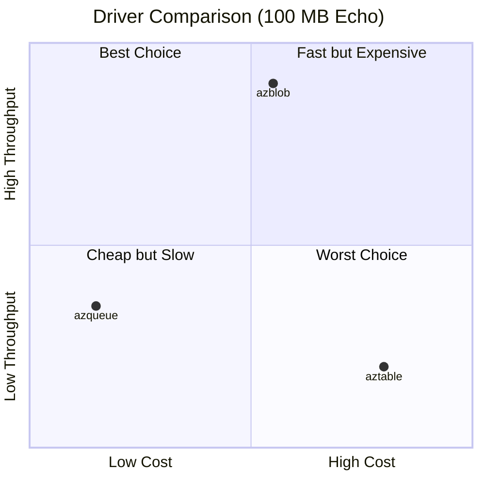

`aznet` supports three different Azure Storage services as transport layers. Each service has unique characteristics that affect performance, cost, and reliability.

:::note
Benchmarks were performed using iperf3 through an aznet SOCKS proxy against live Azure infrastructure.
:::

## Available Drivers

| Driver                          | Storage Service     | Best For                                                     | Recommended Account Type |
| :------------------------------ | :------------------ | :----------------------------------------------------------- | :----------------------- |
| **[azblob](/drivers/azblob)**   | Azure Blob Storage  | **Performance.** High throughput and low latency.            | Premium (Block Blobs)    |
| **[azqueue](/drivers/azqueue)** | Azure Queue Storage | **Cost.** High efficiency for small messages and batch jobs. | Standard (GPv2)          |
| **[aztable](/drivers/aztable)** | Azure Table Storage | **Balanced.** (Generally not recommended over Blob/Queue).   | Standard (GPv2)          |

:::caution[Account Compatibility]
Note that **Premium Block Blob** accounts **do not support** Queues or Tables. If you plan to use all three drivers, you should create separate accounts or use a **Standard** account for everything (though `azblob` will be significantly slower).
:::

## Quick Decision Guide

### When to use `azblob`?

- You need the **highest possible throughput** (up to 3.07 MB/s sender / 2.65 MB/s receiver).
- You are transferring **large files** or streams.
- You have a **user-facing application** where latency matters.
- You want the simplest setup.

### When to use `azqueue`?

- You are running **background or batch jobs**.
- **Cost optimization** is your primary concern (up to 80% cheaper than Blob for small transfers).
- You are sending **small, frequent bursts** of data.

### When to use `aztable`?

- Generally, `aztable` is kept for compatibility or specific architectural requirements. In most benchmarks, it is slower than `azblob` and more expensive than `azqueue`.

## Comparison Summary

| Metric             | azblob  | azqueue  | aztable   |
| :----------------- | :------ | :------- | :-------- |
| **Max Chunk Size** | 4 MB    | 48 KB    | 960 KB    |
| **Relative Speed** | Fastest | Medium   | Slowest   |
| **Relative Cost**  | Medium  | Cheapest | Expensive |
| **Reliability**    | High    | High     | High      |

:::tip[Detailed Analysis]
For a deep dive into the numbers, check out our [Cost Analysis](/drivers/cost) and [Performance Analysis](/drivers/performance).
:::
