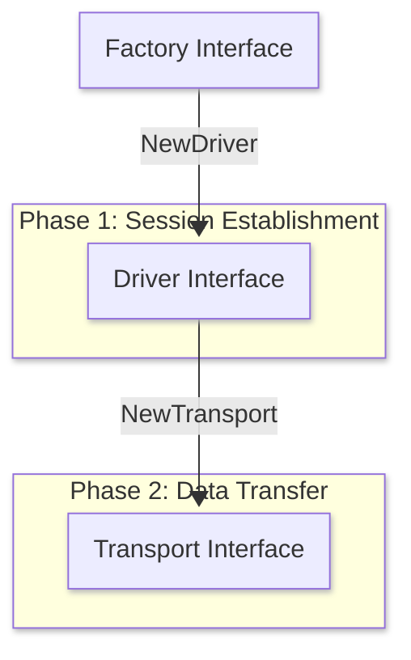

`aznet` is designed with a pluggable architecture. You can add support for new Azure services or even other cloud providers by implementing a set of core interfaces.

Each of the three built-in drivers (`azblob`, `azqueue`, `aztable`) is roughly **~300 lines of Go code**, making it straightforward to add new ones.

## Architecture Overview

Drivers in `aznet` follow a three-layer architecture: **Factory** → **Driver** → **Transport**.



| Layer | Responsibility | Methods |
| :---- | :------------- | :------ |
| **Factory** | Creates a `Driver` from a parsed endpoint and config. | `NewDriver()` |
| **Driver** | Handles the connection lifecycle: handshake, token exchange, session creation, and cleanup. | `PostHandshake()`, `GetHandshakes()`, `DeleteHandshake()`, `PostToken()`, `GetToken()`, `DeleteToken()`, `CreateSession()`, `CreateBootstrapTokens()`, `NewTransport()`, `CleanupBootstrap()`, `CleanupSession()` |
| **Transport** | Raw byte-exchange for an established session. | `WriteRaw()`, `ReadRaw()`, `Close()`, `LocalAddr()`, `RemoteAddr()`, `MaxRawSize()` |

## Step 1: Implement the Factory Interface

The `Factory` is the entry point. It creates a `Driver` from a parsed endpoint.

```go
type Factory interface {
    NewDriver(ep *Endpoint, cfg *Config) (Driver, error)
}
```

Factories must register themselves in an `init()` function:

```go
func init() {
    aznet.RegisterFactory("myservice", &myFactory{})
}

type myFactory struct{}

func (f *myFactory) NewDriver(ep *aznet.Endpoint, cfg *aznet.Config) (aznet.Driver, error) {
    // Initialize your Azure SDK client using ep.Account, ep.Key, ep.ServiceURL(), etc.
    // Return your Driver implementation.
    return &myDriver{ep: ep, cfg: cfg, client: client}, nil
}
```

### Using the Endpoint Helper

`aznet.Endpoint` provides helpers for parsing URLs, extracting credentials, and determining if the target is a local Azurite instance or live Azure.

```go
ep.Account   // Storage account name
ep.Key       // Storage account key
ep.IsAzure   // true if *.core.windows.net
ep.URL       // Parsed *url.URL
ep.ServiceURL()            // Base service URL (e.g., https://account.blob.core.windows.net)
ep.JoinURL(resource, sas)  // Append resource path and SAS token
```

## Step 2: Implement the Driver Interface

The `Driver` handles all of **Phase 1**: the Noise handshake, token exchange, and session setup.

```go
type Driver interface {
    // Handshake operations
    PostHandshake(ctx context.Context, connID string, data []byte) error
    GetHandshakes(ctx context.Context) ([]Handshake, error)
    DeleteHandshake(ctx context.Context, id string) error

    // Token exchange operations
    PostToken(ctx context.Context, connID string, data []byte) error
    GetToken(ctx context.Context, connID string) ([]byte, error)
    DeleteToken(ctx context.Context, connID string) error

    // Session lifecycle
    CreateSession(ctx context.Context, connID string) (SessionTokens, error)
    CreateBootstrapTokens() (hSAS, tSAS string, err error)

    // Transport creation
    NewTransport(ctx context.Context, connID string, tokens SessionTokens, isInitiator bool) (Transport, error)

    // Cleanup
    CleanupBootstrap(ctx context.Context) error
    CleanupSession(ctx context.Context, connID string) error
}
```

### Method Requirements

#### Handshake Operations

Your driver needs a **shared, named resource** (e.g., a container, queue, or table) where:

- `PostHandshake()` stores the client's initial Noise handshake message, identified by `connID`.
- `GetHandshakes()` lists all pending handshake requests. The server calls this to discover new clients.
- `DeleteHandshake()` removes a processed handshake entry by its `Handshake.ID`.

#### Token Exchange Operations

A second **shared resource** is needed for token exchange:

- `PostToken()` stores the server's encrypted response (containing SAS tokens), keyed by `connID`.
- `GetToken()` retrieves the encrypted response for a given `connID`. Return `aznet.ErrNoData` if not yet available.
- `DeleteToken()` removes the token entry after retrieval.

#### Session Lifecycle

- `CreateSession()` provisions **dedicated, per-connection resources** (e.g., a container with two blobs, two queues, or two tables). Returns `SessionTokens` containing scoped SAS tokens for the request and response channels.
- `CreateBootstrapTokens()` generates SAS tokens granting access to the handshake and token resources. The handshake SAS needs write permissions; the token SAS needs read permissions.
- `NewTransport()` creates a `Transport` for the established session using the provided `SessionTokens`.

#### Cleanup

- `CleanupBootstrap()` removes the shared handshake and token resources.
- `CleanupSession()` removes the per-connection resources created by `CreateSession()`.

## Step 3: Implement the Transport Interface

The `Transport` handles **Phase 2**: the actual exchange of raw, encrypted data.

```go
type Transport interface {
    WriteRaw(ctx context.Context, data io.ReadSeeker) error
    ReadRaw(ctx context.Context) (io.ReadCloser, error)
    Close() error
    LocalAddr() net.Addr
    RemoteAddr() net.Addr
    MaxRawSize() int
}
```

### Key Considerations

- **WriteRaw**: Accepts an `io.ReadSeeker` (not `[]byte`). The `ReadSeeker` allows retrying uploads on transient failures without re-buffering.
- **ReadRaw**: Returns an `io.ReadCloser` (not `[]byte`). If no data is available, return `aznet.ErrNoData`. The core `aznet.Conn` handles adaptive polling for you.
- **MaxRawSize**: Return the absolute maximum capacity of a single data unit for the underlying service (e.g., 4 MB for Blob, 64 KB for Queue). The core automatically subtracts encryption overhead (`NoiseOverhead = 20 bytes`) and framing overhead (`FrameHeaderSize = 5 bytes`) to determine the application-level MTU.
- **LocalAddr / RemoteAddr**: Use the provided `aznet.ServiceAddr` struct which implements `net.Addr`.

### ServiceAddr

`aznet` provides a reusable `net.Addr` implementation:

```go
type ServiceAddr struct {
    Net      string // driver name (e.g. "azblob")
    Endpoint string // base service URL
    Resource string // resource identifier
}
```

### Optional: Rotator Interface

If your storage backend has per-resource limits (e.g., Azure Append Blobs have a 50,000 block limit), implement the `Rotator` interface on your `Transport`:

```go
type Rotator interface {
    ShouldRotate() bool
    RotateTX(ctx context.Context) error
    RotateRX() error
}
```

The core detects this interface and handles rotation signaling automatically by sending `MsgTypeRotate` control frames to the peer.

## Best Practices

1. **Use Adaptive Polling**: Don't implement your own polling loops in `ReadRaw`. Return `aznet.ErrNoData` and let the core `aznet.Conn` manage the sleep intervals.
2. **Resource Cleanup**: Ensure `CleanupBootstrap` and `CleanupSession` properly remove any Azure resources created during the session.
3. **Respect Context**: Always pass the `context.Context` from the interface methods to your underlying SDK calls to support cancellation.
4. **Error Wrapping**: Wrap SDK errors with `fmt.Errorf("context: %w", err)` to help users debug connection issues.
5. **SAS Tokens**: Use `cfg.SASTimes()` to get consistent start/end times for SAS token generation (includes 5-minute clock skew tolerance).

