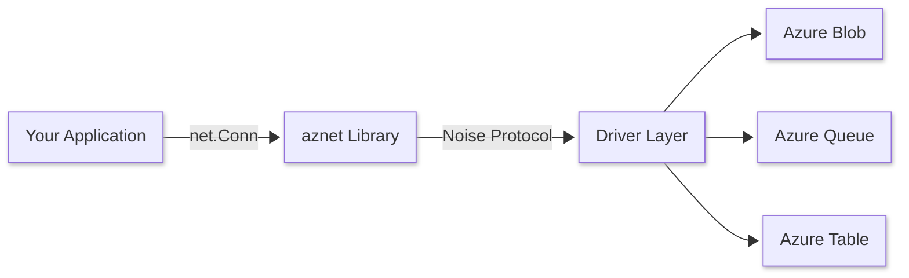

import { Card, CardGrid } from "@astrojs/starlight/components";

## Why aznet?

<CardGrid stagger>
  <Card title="Standard Interface" icon="puzzle">
    Full `net.Conn` implementation that works with existing Go networking code.
    Any library that accepts `net.Conn` can use aznet.
  </Card>
  <Card title="End-to-End Encryption" icon="seti:lock">
    Built-in Noise Protocol (NN pattern) for secure communication. Data is
    encrypted before it ever touches Azure Storage.
  </Card>
  <Card title="Multiple Drivers" icon="list-format">
    Choose between Blob, Queue, or Table storage based on your performance and
    cost requirements.
  </Card>
  <Card title="Firewall Traversal" icon="random">
    Communicate through restrictive environments that block traditional TCP/UDP
    ports but allow HTTPS traffic to Azure.
  </Card>
</CardGrid>

## How it works

aznet abstracts Azure Storage services into a standard networking interface.
Your application code stays the same, while the data flows through Azure's highly available cloud infrastructure.

## Use Cases

- **Serverless Networking**: Connect serverless functions without complex VPC or VNET configurations.
- **Firewall Traversal**: Tunnel SSH and databases through environments that block traditional ports but allow outbound HTTPS.

## Limitations

While `aznet` is powerful, it is not a direct replacement for low-latency TCP in all scenarios:

- **Latency**: Polling-based reads introduce latency compared to direct socket I/O.
- **Cost**: Each "packet" involves Azure Storage API calls which incur costs.
- **Throughput**: Subject to Azure service quotas and throttling.

For a detailed analysis, see our [Performance](/drivers/performance) and [Cost](/drivers/cost) comparisons.
